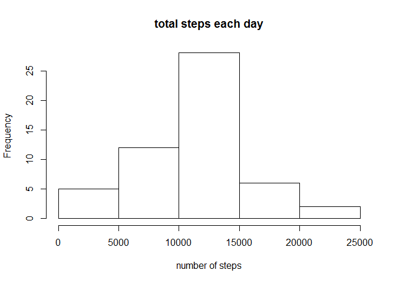
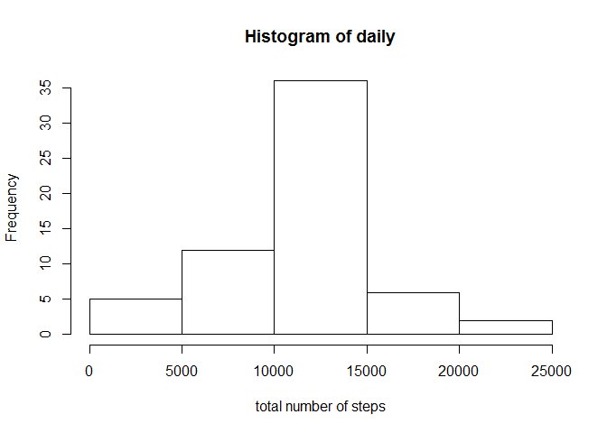
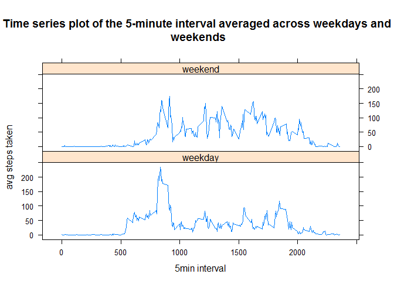

# Reproducible Research: Peer Assessment 1


## Loading and preprocessing the data

```r
 unzip("repdata_data_activity.zip")
```

```
## Warning in unzip("repdata_data_activity.zip"): error 1 in extracting from
## zip file
```

```r
 act<-read.csv("activity.csv")
```


## What is mean total number of steps taken per day?

```r
total<-aggregate(steps~date,act,sum)
hist(total$steps,xlab="number of steps",main="total steps each day")
```

<!-- -->

```r
result<-mean(total$steps,na.rm=TRUE)
result
```

```
## [1] 10766.19
```

```r
med<-median(total$steps)
med
```

```
## [1] 10765
```


## What is the average daily activity pattern?

```r
avg<-aggregate(steps~interval,act,mean,na.rm=TRUE)
plot(avg,type="l")
```

<!-- -->

```r
maxstep<-avg[which.max(avg$step),1]
maxstep
```

```
## [1] 835
```


## Imputing missing values
The mean values of the intervals are used to fill the missing values 

```r
sum(is.na(act$steps))
```

```
## [1] 2304
```


```r
nodaily<-act
n<-is.na(nodaily$steps)
nona<-tapply(act$steps,act$interval,mean,na.rm=TRUE)
nodaily$steps[n]<-nona[as.character(nodaily$interval[n])]
daily<-tapply(nodaily$steps,nodaily$date,sum,na.rm=TRUE)
hist(daily,xlab="total number of steps")
```

<!-- -->

```r
mean(daily)
```

```
## [1] 10766.19
```

```r
median(daily)
```

```
## [1] 10766.19
```


## Are there differences in activity patterns between weekdays and weekends?

```r
act1<-act
end<-weekdays(as.Date(act1$date)) %in% c("Saturday","Sunday")
act1$dtype<-"weekday"
act1$dtype[end==TRUE]<-"weekend"
act1$dtype<-as.factor(act1$dtype)
library(lattice)
avgsteps<-aggregate(steps~interval+dtype,act1,mean)
xyplot(avgsteps[,3]~interval|dtype,avgsteps,type="l",layout=c(1,2),main="\nTime series plot of the 5-minute interval averaged across weekdays and\n weekends",xlab="5min interval",ylab="avg steps taken")
```

<!-- -->
